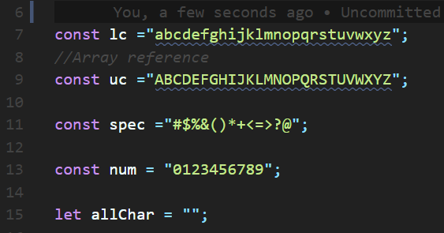
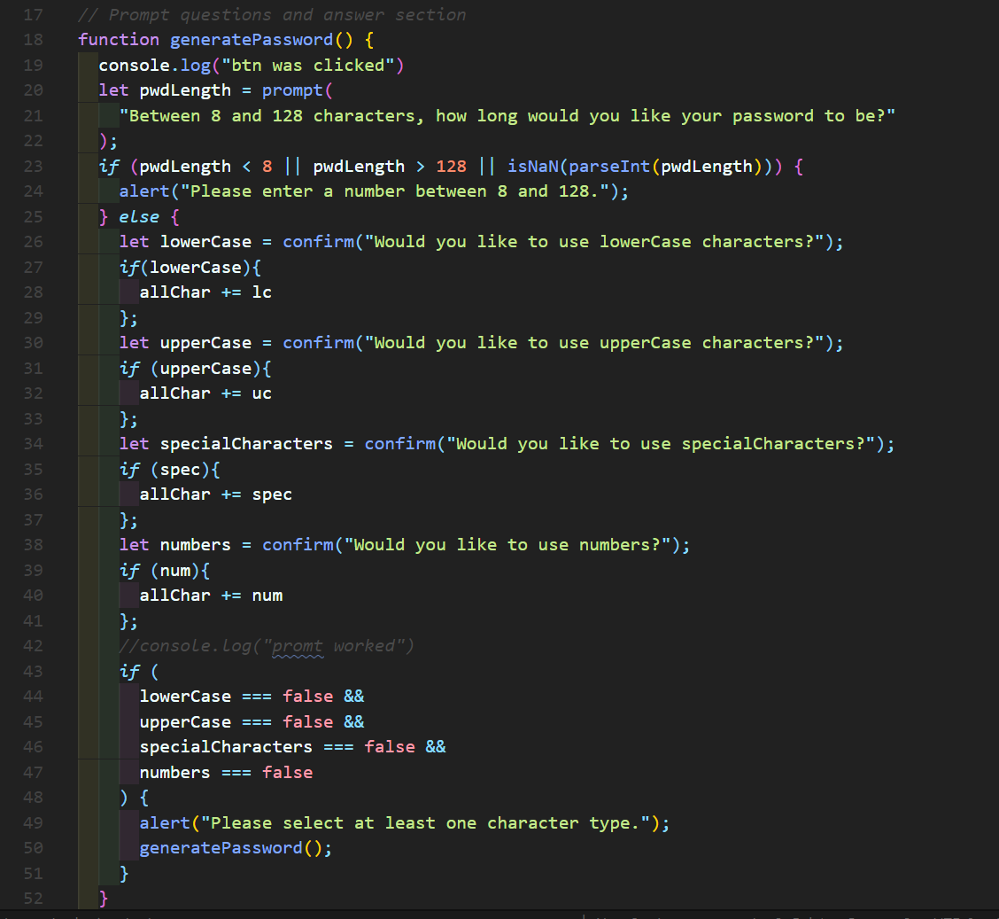

# Project: JavaScript: Password Generator

  Deployable Link - >  https://reindeercode.github.io/JavaScript-Random-Password-Generator/

## Table of Contents: 
- [Project: JavaScript: Password Generator](#project-javascript-password-generator)
  - [Table of Contents:](#table-of-contents)
  - [License:](#license)
  - [Description:](#description)
  - [Images:](#images)
  - [Installation Instructions:](#installation-instructions)
  - [Test Command:](#test-command)
  - [Github:](#github)
  - [My Email Address:](#my-email-address)
  - [Other Contributors:](#other-contributors)

## License:

## Description:
Create an application that an employee can use to generate a random password based on criteria they’ve selected by modifying starter code. This app will run in the browser, and will feature dynamically updated HTML and CSS powered by JavaScript code that you write. It will have a clean and polished user interface that is responsive, ensuring that it adapts to multiple screen sizes.

## Images:

## Installation Instructions: 
Launch in default browser.

## Test Command: 
To test type Click "Generate Password" button and follow alert messages. into the terminal

## Github: 
Check out more projects on my Github at https://github.com/ReindeerCode

## My Email Address:
If you have any questions please feel free to email me at ReindeerCode@gmail.com

## Other Contributors:
None at this time.
